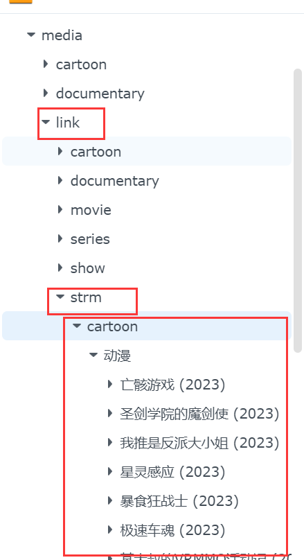
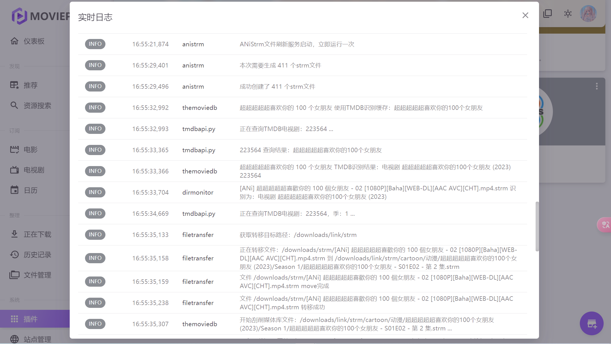

- [1. ANiStrmHub插件](#MoviePilot-x-ANi-Strm)
    - [2023-10秋 刮削效果](#2023-10秋-刮削效果)
    - [注意事项](#注意事项)
    - [Todo](#Todo)

## v5.0.0 更新：架构重构——订阅源/加速源改成对称的"列表+单选生效"模型

### 起因：一条真实坏链接暴露出的架构问题

4.0.0 上线后实测出一条坏链接：`https://pro.pili.cc.cd/ani.td.ee/2025-10/...`——加速源前缀 `pili` 被套在了另一个域名 `ani.td.ee`（本 README 里明确记录过的已知限流失效镜像）外面，拼出一个谁都处理不了的双层地址。

排查根因发现这不是孤立 bug，而是**架构本身的问题**：4.0.0 的"订阅源"是多个 RSS 镜像同时启用、按标题去重、谁先抓到内容就用谁的直链（"多源聚合"模型）；"加速源"是后来单独加的一套"列表 + 选中生效"模型。这两套机制互不知道对方状态——加速源套壳时，完全不知道这条直链究竟来自哪个数据源、那个数据源现在健不健康，于是"一个本该被 `#` 禁用的失效源意外生效，贡献了内容，又被自动套上一层不相关的加速前缀"这种组合，系统设计上根本没有被排除掉。类似"意外启用失效源"的问题在 v3.6.0/v3.7.0 已经出现过一次，这次是它的又一次变种。

决定不再在旧架构上打补丁，从 0 重新设计，把订阅源和加速源改成**完全对称的"列表 + 单选生效项"模型**：同一时刻只有一个订阅源在被使用、一个加速源在被套用，加速源套壳的对象永远是"当前生效订阅源"抓到的直链，两者不会来自互相不知道对方是谁的两个独立数据源——从设计上排除了这次踩到的那类 bug。失效兜底也从"自动切换"改成"用户手动切换 + 概览页矩阵可见"：生效源连不上了不会静默切到列表里别的源（那正是问题成因），而是连通性矩阵会清楚显示"这个源现在连不上"，用户自己决定换哪个。

### 新增：本地 strm 维护（合并掉 4.0.0 的四个独立任务）

`修复失效链接`/`一键切换来源`/`一键加速`/`一键还原`合并成一个"本地 strm 维护"，用两个选择器表达所有组合：

| 目标订阅源 | 目标加速源 | 等价于旧版的哪个操作 |
|---|---|---|
| 不变 | 不加速 | 一键还原 |
| 不变 | 选中某加速源 | 一键加速 |
| 选中某订阅源 | 不加速 | 一键切换来源 |
| 选中某订阅源 | 选中某加速源 | 切换来源 + 加速一步到位（旧版没有的新能力） |

### 新增：概览页连通性矩阵

对每个未禁用的订阅源取一条样本直链，测"直连"，再测"套上每个未禁用的加速源"之后的连通情况。行 = 订阅源，列 = [直连, 加速源1, 加速源2, ...]。这张矩阵直接回答"该选哪个订阅源 + 哪个加速源组合"——用户看一眼矩阵就知道某个源/某个组合连不通，不用等生成出坏链接才发现。取代 4.0.0 分开的"数据源健康度"+"加速源健康度"两张表，同时统计本地 strm 按"订阅源+加速源"分类的分布，取代只按域名统计的旧版分布表。

### 保留：资源补齐

回溯集数探测的设计（`EPISODE_NUM_RE` 集数定位、`build_episode_variant_link`/`build_title_variant` 候选构造、严格串行 + 限流探测、连续性假设提前终止、确认可达才写入）完全保留，已用真实链接验证过，这次只是最后"套壳"这一步改成调用简化后的统一套壳逻辑。

### 移除：Relay 转发（移出这次范围，等真正做"本地局域网代理"规划项时重新设计）

4.0.0 的 Relay 转发（`RelayService`、`get_api()` 注册的 `/relay` 路由、配置页的独立开关）整体移除。这是一次性破坏性重构，`get_api()` 恢复成 `return []`，插件重新回到只依赖标准库 + apscheduler/pytz 的轻量状态。

对 MoviePilot 官方源码（`jxxghp/MoviePilot`）的调研结论仍然有效、记录在案，供以后参考：
- 插件路由挂载逻辑（`app/adapters/web/plugin/routes.py`）里，`get_api()` 返回的字典若带 `"allow_anonymous": True`，会完全跳过 MP 标准的登录态/apikey 鉴权，路由变成匿名可访问——参照官方 `MoviePilot-Plugins` 仓库 `clashruleprovider` 插件的写法：路由匿名放行，函数体内自己校验 URL 参数里的 token
- `RequestUtils`（`app/adapters/network/http.py`）除了默认一次性下载完的 `get_res()`，还有专门的 `get_stream()`（`@contextmanager`），底层是标准 `requests.Session`，支持真流式转发

等真正做"本地局域网代理直接对 strm 加速"这个规划项时，会重新设计成"加速源列表里的一种类型"（选中后在加速源下拉里出现），而不是这次这种独立的整体开关模式。

### 配置需要重新填写

这是破坏性重构，字段结构整个变了（`rss_sources` 多源聚合 → `subscription_sources` + `active_subscription_source`；`proxy_prefixes`/`active_proxy_prefix` → `accelerator_sources`/`active_accelerator_source`；`relink_once`/`migrate_once`/`apply_proxy_prefix_once`/`restore_proxy_once` → 统一的 `target_subscription_source`/`target_accelerator_source`/`apply_local_strm_once`），旧配置不做迁移，升级后需要重新在配置页填写订阅源和加速源。

## v4.0.0 更新：加速源体系完善 + 资源补齐 + Relay转发(实验性，5.0.0已移除)

### 加速源体系完善

v3.8.0 的「套代理前缀」发布后发现一个真实遗漏：`proxy_prefix` 只在「事后批量套壳」（`__apply_proxy_prefix_task`）里生效，拉新番的主任务（`__task`）压根没用上——配了代理前缀，新拉的番还是裸链接，得手动再跑一次套壳。这一版修：

- `proxy_prefix`（单值）升级成 `proxy_prefixes`（多行列表，格式同数据源列表，一行一个地址，`#` 开头禁用），旧配置自动迁移成列表第一项
- 新增「当前生效加速源」下拉选择器：不选则默认用列表第一个未禁用的
- **拉新番自动套用**：`__task` 生成新 strm 时直接调用当前生效加速源套壳，不用再手动跑「一键加速」——这里不逐条探测确认可达（信任加速源已经通过「探测加速源」验证过），跟事后批量套壳（会逐条探测）是不同场景
- 新增「一键还原」：`__apply_proxy_prefix_task` 的反向操作，把已套壳的 strm 改回官方裸直链（`https://resources.ani.rip` + 资源路径），写入前依然实测探测确认可达才覆盖。用于换加速源前清基线，或加速源全部失效时回退
- 新增「探测加速源延迟/网速」：跟"数据源健康度"是两回事——用同一条样本直链分别套上每个配置的加速源前缀实测，标出网速最快的推荐节点，结果单独一张卡片展示

### 资源补齐（回溯集数探测）

**背景**：`ani-download.xml` 只是滚动窗口，只含近期资源（实测例子：某剧 RSS 里只有第 11 集）。但 ANi 同一部剧全部集数的直链只有集数数字不同，季度目录按首播月份命名不按每集实际上传日期——用户实测确认：

```
https://pro.pili.cc.cd/resources.ani.rip/2026-7/[ANi] 盡墳王 - 11 [1080P][Baha][WEB-DL][AAC AVC][CHT]?d=mp4
```
手动把 `- 11` 改成 `- 10`，同一个季度目录下依然能播放。

**设计**：对本地已有的每部剧，从当前最早一集往前递减集数构造候选直链（`EPISODE_NUM_RE` 定位形如 `" - 11 ["` 的集数子串，避免误命中季度目录 `yyyy-mm` 或分辨率 `1080P` 里的数字），**严格串行探测（不并发）+ 探测间隔固定 sleep + 单次任务设总探测数上限**，一旦某一集探测不可达就停止继续往前探测这部剧（假设更早的集数同样不可达或已下架，没必要继续浪费请求）——这几条限流设计都是用户明确要求的，避免高频请求被目标站点风控封 IP。确认可达才写入，不是无脑改写。手动触发「一键补齐」，不进定时任务。

### Relay 转发（实验性，未在真实 MoviePilot 环境验证过）

**目标**：strm 文件里存的不再是裸直链，而是指向 MoviePilot 自己一个转发接口的 URL；这个接口在服务端（已经配好 `use_proxy`）代为请求真实的 ANi 直链，把视频字节流（支持 Range）转发给 Emby/Jellyfin。这样即使真实直链域名国内连不通，只要 MoviePilot 自己能走代理连通，播放就能成功——不需要改 Emby 任何配置、不需要额外端口。

**实现依据**（对 [jxxghp/MoviePilot](https://github.com/jxxghp/MoviePilot) 官方源码的调研，不是猜的）：

- 插件路由鉴权：`app/adapters/web/plugin/routes.py` 的路由挂载逻辑里，`get_api()` 返回的字典若带 `"allow_anonymous": True`，会完全跳过 MP 标准的登录态/apikey 鉴权依赖，路由变成匿名可访问——这正是 Emby/Jellyfin 这类不带 MP 登录态的客户端需要的。参照官方 `MoviePilot-Plugins` 仓库 `clashruleprovider` 插件的写法：路由匿名放行，函数体内自己用 `secrets.compare_digest` 比对 URL 参数里的 token
- 流式转发：`RequestUtils`（`app/adapters/network/http.py`）除了默认一次性下载完的 `get_res()`，还有专门的 `get_stream()`（`@contextmanager`），底层是标准 `requests.Session`，可以 `iter_content()` 分块转发，不用把整个视频文件读进内存

**具体实现**：`get_api()` 注册 `/relay` 路由（`allow_anonymous: True`），`relay_endpoint()` 校验 URL 参数里的 token（`secrets.compare_digest` 语义，见 `RelayService.is_authorized`），透传请求方的 `Range` 头，手动驱动 `get_stream()` 这个 contextmanager（不用 `with`——`with` 会在函数 `return` 的瞬间就把上游 response 关闭，那时候 `StreamingResponse` 还一个字节都没消费），转发时用 `RelayService.filter_upstream_headers()` 剥掉 `Connection`/`Transfer-Encoding` 等 hop-by-hop 头，只保留 `Content-Type`/`Content-Length`/`Content-Range`/`Accept-Ranges`。

**为什么标"实验性"**：以上源码调研针对的是 MoviePilot `v3` 分支（对应 `plugins.v3`），`v2` 宿主的 `RequestUtils`（`app.utils.http`）是否也有 `get_stream()` 没有单独确认过，风险高于 v3；更重要的是，`allow_anonymous` 鉴权绕过和整条转发链路（包括 Range 拖进度条是否流畅、多人同时播放对 MoviePilot 自身并发/内存的影响）都还没有在真实 MoviePilot + Emby/Jellyfin 环境端到端跑通过——sandbox 里只能对 `RelayService`/`relay_endpoint` 的纯逻辑分支（token 校验、上游失败处理、流式转发的生成器行为）做离线单测，FastAPI 路由挂载和真实网络这两层测不到。**默认关闭**，配置页有明显警示，建议先小范围试播一集确认没问题再放心用。

跟「加速源」是二选一关系：开启 Relay 后新生成的 strm 不会再叠加加速源前缀（代理已经在 MoviePilot 发起请求时通过 `use_proxy` 生效，叠加前缀是画蛇添足）。

### 配置页重新排版

之前"维护操作"是一整张卡片，RSS 数据源维护、加速源管理、资源补齐全部堆在一起。拆成三张独立卡片（数据源维护/加速源管理/资源补齐），加上新增的 Relay 转发卡片，各自标题+配色+范围内的说明文字，不用再在一堆开关里找哪个说明对应哪个功能。

## v3.8.0 更新：本地strm一键套代理前缀

**背景**：用户国内网络下 ANi 官方域名直连不通，需要走代理/反代镜像才能访问；本地已经攒了一批 strm 是裸官方地址（`resources.ani.rip`），想批量给它们套上一个能连通的镜像地址。

**这不是"域名替换"，是"前缀拼接"**——这两种转换结果不一样，容易搞混：

- 域名替换（`修复失效链接`/`一键切换来源`用的方式，`derive_prefix`+`extract_resource_path`）：`https://resources.ani.rip/2025-10/xxx?d=mp4` → 丢掉`resources.ani.rip`，换成`https://pro.pili.cc.cd/2025-10/xxx?d=mp4`
- 前缀拼接（这次新增的`proxy_prefix`用的方式，`build_proxied_url`）：保留原host，整体包一层 → `https://pro.pili.cc.cd/resources.ani.rip/2025-10/xxx?d=mp4`

后者才是 pili/op5 这类"Proxy Everything"反代实际生成 RSS 时用的真实格式（已经实测确认），也是用户明确要求的效果。两种转换公式不能混用。

**用法**：配置页填一个代理前缀（如`https://pro.pili.cc.cd`），勾选「立即给本地strm套上代理前缀」。扫描`storageplace`下所有`.strm`文件，不管当前是裸官方地址还是已经走了别的镜像，整体包一层新前缀；如果内容已经以这个前缀开头就跳过（不重复叠加）；写入前用`probe_latency_ms`实测确认新地址可达，探测不通过的保留原文件不动。

真实网络端到端验证过：3个裸官方地址的strm全部正确套上`pro.pili.cc.cd`前缀，格式和实测的 pili 真实RSS格式完全一致。

## v3.7.0 更新

装了v3.6.0之后用户反馈修复链接**仍然**大量"候选链接探测不可达"，怀疑是不是插件没有文件写权限。排查过程：

- 先排除权限问题：权限报错走的是完全不同的日志分支（`创建strm源文件失败`），"探测不可达"是纯网络判定，根本没走到写文件那一步。
- 抽查用户日志里失败的具体番剧（GRAND BLUE ep02，当时最新集是ep12），手动构造同样的候选链接实测——**pili真的还在服务这一集**，200/206都能拿到，排除了"社区镜像只保留近期几集、老集数已经被清掉"这个猜测。
- 真正原因：v3.6.0虽然改成了"探测挑一个健康源当参照"，但一次修复任务要处理几十上百个文件、跑好几分钟，全程只认定**唯一一个**参照源——这个源中途只要被限流/网络抖动一下，后面所有文件就会一起失败，表现成一长串"不可达"，很容易被误判成别的问题。而且原来的日志只写死"不可达"三个字，看不出究竟是真死了、纯超时、还是被限流，没法排查（这条本身就是设计缺陷）。

修复：

- `probe_latency_ms()` 现在返回 `(延迟ms, 失败原因)`，失败原因具体到 HTTP 状态码或异常信息，不再是一句"不可达"打发
- 参照源从"选唯一一个"改成"探测出全部健康候选，按优先级排好序"，`relink_existing()` 对每个文件的路径迁移**逐个候选前缀尝试**，第一个连不上/超时立刻换下一个，不会被单个源的抖动拖累整批任务
- 「一键切换到指定来源」语义不变，仍然只认用户选的那一个目标，不做候选兜底——这跟"自动修复"的语义不一样，不能混

同时做了另外两件事：

- **探测加测速排节点**：`probe_speed_kbps()` 下载1MB实测网速（不是整部视频），延迟测的是首字节耗时（类似ping），网速最快的可播放源标「🚀推荐」。真实网络跑出来延迟2000~3700ms、网速300~380KB/s这个量级，两个源实测有差异，推荐节点会跟着变化，不是写死的
- **拉取季度筛选**（轻量版）：新增 `season_filter` 配置，可以只处理RSS窗口内某个季度的条目。**跟honue原版的"季度多选补历史"不是一回事**——原版靠目录扫描API能列出所有历史季度文件夹，那套接口已经确认死了（见下文）；这里只能从RSS滚动窗口(近期约50~60条)里已经出现过的季度中选，选不到窗口外的老季度，纯粹是"筛选窗口内已有的"，不是"补历史缺失的"

## v3.6.0 真实环境踩坑记录（用户实测反馈）

装到真实 MoviePilot 实例后暴露出3个问题，都是本地mock测试的盲区：

1. **保存配置会卡住不动**：真bug。`stop_service()` 里 `scheduler.shutdown()` 默认 `wait=True`，
   如果上一次「修复失效链接」这类耗时任务还在后台线程跑（逐条探测候选链接，几十上百个文件可能跑好几分钟），
   这时候保存配置会先走 `init_plugin()` → `stop_service()`，直接被阻塞到旧任务跑完才返回。
   改成 `shutdown(wait=False)`，用真实 APScheduler（不是mock）验证过：旧任务运行中时调用
   `stop_service()`，从阻塞2秒+降到0.000秒立即返回。之前的单测把调度器整个stub掉了，这类
   生命周期/并发bug完全测不出来，这是测试设计上的盲区，如实记录。

2. **数据源列表被误清理导致大量探测超时**：用户截图里数据源列表7条全部没有 `#` 注释——
   默认值里给已知失效源（v300/td.ee/openani等）配的中文说明太长，容易被当成"啰嗦的示例文本"
   清空重写，导致这些已知连不上的域名被意外重新启用。改进：`__relink_task` 现在不再盲信
   "配置列表合并后的第一条" 当路径迁移参照源，而是新增 `__pick_healthy_reference_link()`，
   按配置顺序依次探测，找第一个"RSS能拉到 + 样本直链实测真能连"的源才用。这样即使用户误启用了
   死掉的域名，只要列表里还有一个真能用的源，参照选择就会自动跳过死的选活的，不会被拖累。
   端到端复现过用户的场景（v300排第一且没`#`）验证过修复生效。

3. **配置页布局没有主次、丑**：「拉取新番」这个核心功能被四个运维类开关（修复/探测/换源）
   平铺在同一视觉层级，抢了核心配置的注意力。重新分区：核心设置（启用/周期/存储路径/数据源列表）→
   生成规则（可选，文件名清洗/黑名单/分子目录）→ 维护操作（单独用带边框的卡片包起来，明确写"按需
   手动触发，可能耗时几分钟"）。同时新增任务运行状态追踪：每个一次性任务开始时标记"运行中"、
   结束时记录耗时摘要，详情页顶部有一张"任务运行状态"卡片显示各任务当前状态和上次结果，不用再
   干等或者去翻日志猜有没有跑完；同一个任务还在跑的时候重新勾选开关会被跳过，不会排队堆积。

## 改名说明

本插件原名 ANi-Strm，是 honue 原版的 fork。为避免和 honue 原版及其他 fork（ANiStrmPlus、ANiStrmPro 等）撞插件 ID，从 v3.4.0 起插件 ID/类名/目录名统一改为 **ANiStrmHub**。已安装旧版 ANiStrm 的需要按新 ID 重新安装（视为不同插件，配置不会自动迁移）。

## V3 插件规范说明

本插件按 [MoviePilot 插件开发指南（V3）](https://github.com/jxxghp/MoviePilot-Plugins/blob/main/docs/Plugin_Development.md) 组织：插件目录 `plugins.v3/anistrmhub/`，导入统一走 `app.sdk.*` 稳定出口（`app.sdk.config`/`app.sdk.logging`/`app.sdk.network`），不使用 `app.core.*`/`app.utils.*`/`app.log` 等旧路径。索引信息见仓库根目录 `package.v3.json`。

同时按 [V2 插件开发指南](https://github.com/jxxghp/MoviePilot-Plugins/blob/main/docs/V2_Plugin_Development.md) 在 `plugins.v2/anistrmhub/` 提供了 V2 兼容实现（索引 `package.v2.json`）——V2宿主没有 `app.sdk.*`，只能用 `app.core.config`/`app.log`/`app.utils.http` 这几个旧路径，业务逻辑跟这份V3版本逐字节一致，只有import不同。

## 借鉴同类 fork

调研过另外两个同样 fork 自 honue ANi-Strm 的项目——[ANiStrmPlus](https://github.com/MangMax/MoviePilot-Plugins)（MangMax）和 [ANiStrmPro](https://github.com/shanhai2333/MoviePilot-Plugins)（shanhai2333），对比后把有价值的能力吸收了进来：

- **文件名删除字符串**（借鉴 ANiStrmPro）：`filename_remove` 配置项，`@`分隔多个子串，从生成的strm文件名里删掉，不影响标题匹配/一键换源的内部逻辑
- **文件名黑名单**（借鉴 ANiStrmPro）：`filename_blacklist` 配置项，`@`分隔关键词，命中则跳过不生成，例如过滤预告/PV/NCOP
- **字幕文件过滤**（借鉴 ANiStrmPro）：自动跳过 `.srt`/`.vtt`/`.ass`/`.ssa` 后缀的条目
- **按季度分子目录**（借鉴 ANiStrmPlus）：`season_dir` 开关，从直链里提取季度（如 `2026-7`），strm 按季度分子目录存放而不是全部拍平

调研中还发现 ANiStrmPro 的默认"全量补季度"依赖的目录扫描接口（`openani.an-i.workers.dev`）跟我们之前实测的一样是 429 限流死的，实测我们现有的能用镜像（pili/op5）也都没有实现这套老协议——纯视频透传代理，POST目录接口返回的是普通网页不是JSON。所以"全量补季度"这个能力目前没有可用的接口基础，暂不实现。

另外还发现 ANiStrmPro 的默认非镜像模式下有一段 `_convert_url_format`，逻辑跟我们最早踩过的 `?d=mp4`→`.mp4` 后缀改写bug几乎一样——实测在官方 `resources.ani.rip` 域名上同样会导致404。这不是我们瞎猜的边缘case，是独立项目里踩过的同一个坑。

## 2023-10秋 刮削效果

<div align="center">
	
</div>


## MoviePilot x ANi-Strm

建议配合目录监控使用，strm文件创建在你插件填写的地址 如/downloads/strm

通过目录监控插件转移到link媒体库文件夹 如/downloads/link/strm，mp会完成刮削 这样也避免了污染正常视频文件的媒体库

```
/downloads/strm:/downloads/link/strm#copy
```

<div align="center">
	
</div>

不开启一次性创建全部，则每次运行会创建ani最新季度的top15个文件。

<div align="center">
	
</div>

> 非常感谢 https://aniopen.an-i.workers.dev TG:[Channel_ANi](https://t.me/channel_ani)

## v3.0.0 改动说明（本 fork）

原版依赖单一的目录扫描接口（`openani.an-i.workers.dev` 等），一旦该域名被限流/封锁（429/403），插件即完全失效。

本 fork 改为**多 RSS 镜像聚合**：

- 数据源改成解析官方 `ani-download.xml` 格式的 RSS（含 `title`/`link`/`pubDate`/`anime:size`），不再依赖目录扫描 API
- 插件页面新增「数据源列表」文本框，一行一个 RSS 地址，按顺序轮询；某个源请求失败自动跳过，不影响其他源
- 行首加 `#` 可临时禁用某个源而不删除，方便官方域名恢复后重新启用
- 多个镜像抓到同一集时按标题去重，**strm 里写入的是排序靠前的源给出的直链地址**——顺序即优先级

### 实测结果（非常重要，RSS 能拉到 ≠ 视频能播）

只测 RSS 端点返回 200 是不够的：RSS 里的下载直链和 RSS 本身经常不是同一个域名，直链域名可能单独被拦截/限流。逐个用 `Range` 请求实际视频直链验证（curl 模拟播放器分段拖动播放）后：

  | 地址 | RSS 状态 | 视频直链实测 | 结论 |
  |---|---|---|---|
  | `https://api.pili.cc.cd/ani-download.xml` | 200 | `pro.pili.cc.cd` 返回206 Partial Content + 正确 mp4 数据 | ✅ 默认启用 |
  | `https://aniapi.op5.de5.net/ani-download.xml` | 200 | `pro.op5.de5.net` 返回206 Partial Content + 正确 mp4 数据 | ✅ 默认启用 |
  | `https://api.ani.rip/ani-download.xml` | 200 | `resources.ani.rip` 返回206 + 正确 mp4 数据（测试环境非大陆网络，国内是否直连未知） | ✅ 默认启用，排最后兜底 |
  | `https://aniapi.v300.eu.org/ani-download.xml` | 200 | 直链域名 `proi.v300.eu.org` 返回 Cloudflare **"Just a moment..."** JS 挑战页（403），程序化请求过不去 | ❌ 默认禁用 |
  | `https://aniapi.td.ee/ani-download.xml` | 200 | 直链域名 `ani.td.ee` 返回 **"This website has been temporarily rate limited"**，等待重试仍限流 | ❌ 默认禁用 |
  | `http://open.ani.rip/ani-download.xml` | 403（Cloudflare 拦截） | — | ❌ 默认禁用 |
  | `https://openani.an-i.workers.dev/ani-download.xml` | 429（限流） | — | ❌ 默认禁用 |

  被禁用的源都保留在默认列表里（行首 `#`），状态恢复后手动去掉 `#` 即可重新启用。

  **踩坑记录**：官方 RSS（`api.ani.rip`）的条目直链域名是裸的 `resources.ani.rip`，而各能用的社区镜像早就把这个域名替换成了自己的反代域名。所以务必把实测确认可直连的镜像排在前面，官方源放最后只作兜底。

  **另一个踩坑**：`touch_strm_file` 早期版本曾把 RSS link 里的 `?d=mp4` 参数改写成 `.mp4` 后缀，实测这个改写会导致目标反代站点路由不到资源（404）。已经改回直接写 RSS 原始 link，不做任何后缀改写。

### 数据源失效了，本地已经生成的一批 strm 怎么办

不用删了重新生成。插件页面勾选「修复本地失效链接」，立即运行一次：

1. **标题精确匹配**：strm 文件名（去掉 `.strm`）就是当初 RSS 的 `title`。如果这一集还在当前 RSS 的滚动窗口内（RSS 只保留近期约 50~60 条），直接换成当前源给出的最新直链，最准确。
2. **路径迁移兜底**：标题不在当前 RSS 窗口内的老集数（比如失效前很久生成的 strm）——实测发现 ANi 各镜像的直链结构里，`{季度}/{文件名}?d=mp4` 这一段在所有镜像之间是完全一致的（比如 `2026-7/[ANi]...mp4?d=mp4`），只有域名前缀不同（有的镜像多一段 `resources.ani.rip/`，比如 `td.ee` 就没有）。所以从旧链接里提取出这一段，换上当前数据源列表里排第一、且成功抓到内容的源的域名前缀，拼出候选新链接；**写入前会用 Range 请求实际探测一次确认能连通才覆盖**，探测不通过的保留原文件不动，不会瞎改出一堆死链接。
3. 完全无法从旧内容里识别出季度路径的（比如根本不是 ANi 家族的链接），原样跳过不动。

跑完在日志里看统计（精确匹配更新/路径迁移成功/迁移失败保留原文件/无法识别）。

**这个功能开发时联调踩过一个坑**：探测候选链接用的 `get_res(url, headers={"Range": "bytes=0-0"})` 一开始直接传了个只含 `Range` 的 `headers` 字典——MoviePilot 的 `RequestUtils.get_res` 对显式传入的 `headers` 是**整体替换**，不是合并，导致探测请求丢了默认的 `User-Agent`，裸请求直接被 Cloudflare 当可疑流量拦成 403，好端端能连通的链接被误判成"不可达"。改成先用 `update_headers()` 把 Range 头合并进去再请求，才是对的。

### 探测数据源健康度 / 按来源查看本地strm分布 / 一键切换到指定来源

三个能力对应插件页面两个开关一个下拉：

- **「探测各数据源播放健康度」**：勾选立即运行一次，对每个已启用的数据源各抓一条样本，判断 RSS 通不通、视频直链域名真的连不连得上（不是只看 RSS 状态码），顺带扫一遍本地 strm 按当前指向的域名分类计数。结果存起来，不在页面里实时刷新。
- **详情页**（插件卡片的"详情"/查看页，不是配置表单）：展示上面探测的结果——每个数据源的健康状态（可播放/RSS通但连不上视频/不可用）、本地 strm 按域名的数量分布和占比。数据来自最近一次探测缓存，不是实时扫描；要看最新状态就重新勾一次探测开关。
- **「一键切换到指定来源」**（配合"一键切换到指定来源"下拉）：选一个数据源、勾开关、立即运行一次，不管本地 strm 现在能不能播，强制全部统一改写成这个源——逻辑复用"修复本地失效链接"那套标题匹配+路径迁移，只是参照源从"当前排序第一个可用的"变成"用户指定的这一个"。用于主动决定"以后全都走这个镜像"，而不是等失效了才被动修。

**为什么详情页是"缓存快照"不是"实时仪表盘"**：MoviePilot 插件的 `get_page()` 和 `get_form()` 一样是静态 Vuetify 组件树，每次打开页面重新渲染，但页面内部按钮没有内置"点击调 API 刷新"的机制（那需要走完全独立的 Vue 自定义组件打包，`get_render_mode` 才能声明为 `vue` 模式）。所以探测这个"动作"和详情页这个"展示"是分开的两步：先勾开关探测，再打开详情页看结果，不是点一个按钮就地刷新。

## 注意事项

**已解决**  ~~**已定位问题 疑似ffprobe命令读取网络视频的媒体信息时，给容器设定的代理，命令执行不生效**~~
> /bin/ffprobe -i "https://resources.ani.rip/2023-10/[ANi] 葬送的芙莉蓮 - 02 [1080P][Baha][WEB-DL][AAC AVC][CHT]
> .mp4?d=true" -threads 0 -v info -print_format json -show_streams -show_chapters -show_format -show_data

**emby容器代理设置**

❗ ❗ ❗ **环境变量必须多设置一条，键为小写的http_proxy的代理**

[ffprobe源码](https://github.com/FFmpeg/FFmpeg/blob/master/libavformat/http.c#L218C48-L218C48) 使用getenv_utf8("
http_proxy") 对大小写敏感。

emby docker-compose env

```yaml
- 'http_proxy=http://127.0.0.1:7890'
- 'HTTP_PROXY=http://127.0.0.1:7890'
- 'HTTPS_PROXY=http://127.0.0.1:7890'
```
另外clash 这两个域名记得设置代理规则
```
resources.ani.rip
aniopen.an-i.workers.dev
```

## Todo:

- [x] ~~网页、fileball 无法播放的问题，看看能不能解决，或者有无更好的源代替~~。
- [x] 更新获取最新方法，避免跨季度番剧漏抓
- [x] 排查是否存在bug，优化使用
